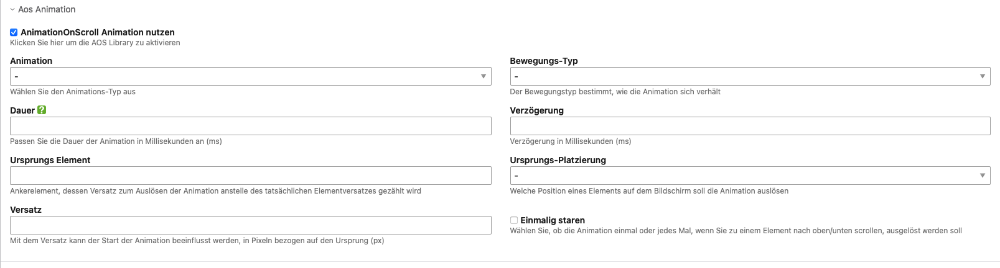

# contao-aos

Animate content elements on scroll using [AOS](https://github.com/michalsnik/aos):

> A small library to animate elements on your page as you scroll.


## Install

1. Install via composer or use the [Contao Manager](https://docs.contao.org/books/manager/de/)

```
composer require jedocodes/contao-aos-bundle
```

2. Open the install tool and do a database update.

3. Include the **js_aos** template in the page layout.

### Screenshot


